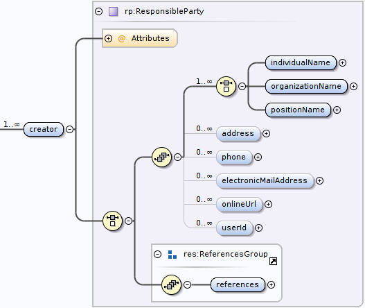

# cite
A data citation generator for PASTA data packages

Cite is a web service data citation generator for data packages found in the
Environmental Data Initiative's PASTA data repository. Cite provides a simple
to use REST end-point:

```https://cite.edirepository.org/cite/<pid>```

where "pid" is a PASTA package identifier. Cite accepts the following options
 as query parameters on the request URL:
 
```?<env>=[production(default), staging, development]```

```?<style>=[ESIP(default), DRYAD]```

The response body format is controlled by the request "Accept" header value. 
Recognized media-types are: `text/plain`, `text/html`, and `application/json`
(note: media-types with parameters are not considered).

## Examples:

```text
curl -i -H "Accept: text/plain" -X GET https://cite.edirepository.org/cite/edi.460.1
HTTP/1.1 200 OK
Server: nginx/1.10.3 (Ubuntu)
Date: Tue, 28 Jan 2020 19:29:17 GMT
Content-Type: text/plain
Content-Length: 275
Connection: keep-alive

Armitage, A.R., C.A. Weaver, J.S. Kominoski, and S.C. Pennings. 2020. Hurricane Harvey: Coastal wetland plant responses and recovery in Texas: 2014-2019 ver 1. Environmental Data Initiative. https://doi.org/10.6073/pasta/e288ccaf55afceecc29bdf0a341248d6. Accessed 2020-01-28.
```

```text
curl -i -H "Accept: text/plain" -X GET https://cite.edirepository.org/cite/edi.460.1?style=DRYAD
HTTP/1.1 200 OK
Server: nginx/1.10.3 (Ubuntu)
Date: Tue, 28 Jan 2020 19:30:48 GMT
Content-Type: text/plain
Content-Length: 238
Connection: keep-alive

Armitage AR, Weaver CA, Kominoski JS, and Pennings SC (2020) Hurricane Harvey: Coastal wetland plant responses and recovery in Texas: 2014-2019. Environmental Data Initiative. https://doi.org/10.6073/pasta/e288ccaf55afceecc29bdf0a341248d6
```

```text
curl -i -H "Accept: text/html" -X GET https://cite.edirepository.org/cite/edi.460.1
HTTP/1.1 200 OK
Server: nginx/1.10.3 (Ubuntu)
Date: Tue, 28 Jan 2020 19:31:27 GMT
Content-Type: text/html
Content-Length: 352
Connection: keep-alive

Armitage, A.R., C.A. Weaver, J.S. Kominoski, and S.C. Pennings. 2020. Hurricane Harvey: Coastal wetland plant responses and recovery in Texas: 2014-2019 ver 1. Environmental Data Initiative. <a href='https://doi.org/10.6073/pasta/e288ccaf55afceecc29bdf0a341248d6'>https://doi.org/10.6073/pasta/e288ccaf55afceecc29bdf0a341248d6</a>. Accessed 2020-01-28.
```

## A note about how Cite generates a citation

The content of a data package citation is derived from the science metadata
that is stored within an [Ecological Metadata Lanaguage](https://eml.ecoinformatics.org)
(EML) document. Specifically, the content comes from within the *creator* section of the EML.

